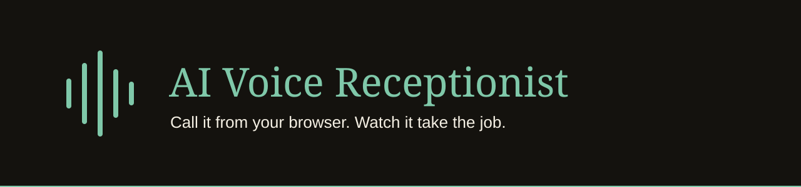

<p align="center"></p>

<p align="center">
  
  
  
  
</p>

**A show-off demo of an AI Receptionist that answers the phone for a made-up South Florida AC repair shop.**

Live site (planned, not live yet): `ai-voice-receptionist.vercel.app`

## Status

| | |
|---|---|
| Phase | Building |
| Shipped | [#2 Step 1: setup and the Call Story](https://github.com/tekguyz/ai-voice-receptionist/issues/2) (a plain Sample Call screen at `/demo`; runs locally, not deployed yet) |
| Next | [#3 Step 2: pick the look](https://github.com/tekguyz/ai-voice-receptionist/issues/3) |
| Updated | 2026-10-04 |

## What it does

Built so far:

- Turns a call's events (lines, captured details, a booking, the end) into the live call view and the Call Notes. This is the Call Story, in `lib/call-story.ts`.
- Plays a Sample Call on a plain screen at `/demo`: lines and detail tags appear in time, then the Call Notes show a summary, the details, the booked time and a preview of the confirmation text.

Planned (spec [#1](https://github.com/tekguyz/ai-voice-receptionist/issues/1)):

- A Visitor presses "Call now" and talks to the Receptionist through the browser microphone.
- The live call screen shows the words and fills in tags as the Receptionist captures name, job, urgency, address and a booked time.
- The Dashboard shows the Owner's side: totals and recent Call Notes.
- The Receptionist answers in Spanish when the caller speaks Spanish.

## What it never does

- Never dials a phone number. Test Calls run in the browser ([ADR 0001](docs/adr/0001-test-calls-run-in-the-browser.md)).
- No sign-in and no accounts ([ADR 0002](docs/adr/0002-demo-only-no-sign-in.md)).
- Never keeps a Visitor's voice. Only words, for 7 days ([ADR 0004](docs/adr/0004-no-audio-kept.md)).
- Never sends a text or email. The confirmation text is a preview.
- Never uses a real business. The Sample Business is made up.

## Stack

Next.js (App Router), TypeScript, Tailwind CSS, Vitest, on Vercel. Planned: Vapi web SDK for voice, Upstash Redis for limits and Call Notes ([ADR 0003](docs/adr/0003-redis-not-supabase.md)).

## Run it locally

Prerequisites: Node 24.

```bash
npm install
npm run dev
```

Then open `http://localhost:3000/demo`. No env file is needed yet.

The Sample Business and Receptionist names live in one file, `lib/sample-business.ts`.

## Tests

```bash
npm run test:unit
```

Never `npm test`: it prints an error and stops on purpose. There is no database, so there is no integration suite.

CI (`.github/workflows/ci.yml`) runs typecheck, `test:unit` and build on every pull request and on every push to `main`.

## Docs

- Spec: [#1](https://github.com/tekguyz/ai-voice-receptionist/issues/1)
- Glossary: [`CONTEXT.md`](CONTEXT.md)
- Product: [`PRODUCT.md`](PRODUCT.md)
- Decisions: [`docs/adr/`](docs/adr/)
- Design references: [`refs/`](refs/)
- Design rules: [`DESIGN.md`](DESIGN.md)

---

<p align="center"><sub>Built by <a href="https://tekguyz.com">TEKGUYZ</a></sub></p>
